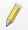

(qgis-prepro)=
# Pre-processing with QGIS

```{admonition} Requirements
:class: attention
Before diving into this tutorial make sure to...

1. Follow the installation instructions for {ref}`qgis-install` in this eBook;
2. Read and understand (or watch) this eBook's {ref}`qgis-tutorial`.
```

The first steps in numerical modeling of a river consist in the conversion of a Digital Elevation Model (**{term}`DEM`**) into a computational mesh. This tutorial guides through the creation of a QGIS project for converting a {term}`DEM` ({term}`GeoTIFF`) into a computational mesh that can be used with various numerical modeling software featured in this eBook. At the end of this tutorial, {ref}`chpt-basement` and {ref}`chpt-telemac` users will have generated a computational grid in the {term}`SMS 2dm` format. {ref}`chpt-openfoam` modelers will have a exported the {term}`DEM` in {term}`STL` file format that still needs to be meshed as explained later in this eBook's *OpenFOAM* {ref}`of-mesh` section.

(start-qgis)=
## QGIS Project and Coordinate Reference System

Launch QGIS and {ref}`create a new QGIS project <qgis-project>` to get started with this tutorial.
As featured in the {ref}`qgis-tutorial`, set up a coordinate reference system (CRS) for the project. This example uses data of a river in Bavaria (Germany zone 4), which requires the following CRS:

* In the QGIS top menu go to **Project** > **Properties**.
* Activate the **CRS** tab.
* Enter `Germany_Zone_4` and select the CRS shown in {numref}`Fig. %s <qgis-crs>`.
* Click **Apply** and **OK**.

```{figure} ../img/qgis/inn-crs.png
:alt: qgis set coordinate reference system crs germany zone_4 Inn river
:name: qgis-crs

Define Germany_Zone_4 as project CRS.
```

```{admonition} Save the project...
:class: tip
Save the QGIS project (**Project** > **Save As...**), for example, under the name **prepro-tutorial.qgz**.
```

(get-dem)=
## Digital Elevation Models (DEMs)
A digital elevation model (**{term}`DEM`**) represents the baseline for any physical analysis of a river ecosystem. Nowadays, {term}`DEM`s often stem from light imaging, detection, and ranging ([LiDAR](https://en.wikipedia.org/wiki/Lidar) combined with bathymetric surveys. Older approaches rely on manual surveying (e.g., with a total station) of cross-sectional profiles and interpolating the terrain between the profiles. The newer LiDAR technique employs lights sources and provides terrain assessments up to 2-m deep water. Bathymetric [echo sounding](https://en.wikipedia.org/wiki/Echo_sounding) is often necessary to map the ground of deeper waters. Thus, merged LiDAR and echo-sounding datasets produces seamless point clouds of river ecosystems, which may be stored in many different file types.

This tutorial uses an application-ready {term}`DEM` in {term}`GeoTIFF` {ref}`raster` format that stems from a LiDAR point cloud. The {term}`DEM` raster provides height (Z) information from a section of a gravel-cobble bed river in South-East Germany, which constitutes the baseline for the computational grids featured in the next sections. To get the provided DEM in the *QGIS* project:

* **Download the example DEM** GeoTIFF [here](https://github.com/hydro-informatics/materials-bm/raw/main/rasters/inn-dem.tif) and save it in the same folder (or a sub-directory) as the above-create **qgz** project.
* Add it as a new raster layer in *QGIS*:
  * In *QGIS*' **Browser** panel find the **Project Home** directory where you downloaded the DEM *tif*.
  * Drag the DEM *tif* from the **Project Home** folder into QGIS' **Layer** panel.

```{admonition} What are QGIS panels again?
:class: tip
Learn more in the *QGIS* tutorial on {ref}`qgis-tbx-install`.
```

* To get a better idea of the project area, add a {ref}`satellite imagery basemap <basemap>` (XYZ tile) under the {term}`DEM` and customize the layer symbology.


The DEM should now be displayed on the map (if not: right-click on the DEM layer and click on **Zoom to Layer(s)** in the context menu) as shown in {numref}`Fig. %s <qgis-dem-basemap>`.

```{figure} ../img/qgis/dem-basemap.png
:alt: qgis import raster DEM basemap
:name: qgis-dem-basemap

Add the BASEMENT repository to QGIS' Plugins Manager.
```

```{admonition} From LiDAR point clouds to a Raster DEM
:class: tip
Terrain survey data are mostly delivered in the shape of an x-y-z point dataset. LiDAR produces massive point clouds, which quickly overcharge even powerful computers. Therefore, LiDAR data may need to be break down to smaller zones of less than approximately 106 points and special LiDAR point processing software (e.g., [LAStools](http://lastools.org/)) may be helpful in this task. The range of possible data products and shape from terrain survey is board and this tutorial exemplary uses a set of x-y-z points stored within a text file.
```


```{admonition} OpenFOAM modelers...
For three-dimensional (3d) modeling with OpenFOAM, the creation of a 2dm file is not necessary. Therefore, OpenFOAM users can export the terrain in QGIS directly as an {term}`STL` file, as described at the bottom of this section (jump to the {ref}`dem2stl` paragraph).
```

(make-2dm)=
## 2dm Mesh for BASEMENT or TELEMAC

The generation of a {term}`SMS 2dm` uses the {ref}`QGIS BASEmesh plugin <get-basemesh>` and requires drawing a

* {ref}`Line Shapefile <create-line-shp>` containing model boundaries and internal breaklines between model regions with different characteristics (section on {ref}`boundary`);
* {ref}`Line Shapefile <create-line-shp>` containing model boundaries for assigning inflow and outflow conditions (section on {ref}`liquid-boundary`); and a
* {ref}`Point Shapefile <create-point-shp>` containing markers for the definition of characteristics of model regions (section on {ref}`regions`).

These two shapefiles enable to {ref}`qualm`. Ultimately, height information is {ref}`interpolated to the quality mesh <qualm-interp>` and the resulting mesh is saved as {term}`SMS 2dm` file. The next sections walk through the procedure step by step with detailed explanations. Additional materials and intermediate data products are provided in the supplemental data repository ([materials-bm](https://github.com/hydro-informatics/materials-bm)) for this tutorial.

(get-basemesh)=
### Get the BASEmesh Plugin

Install *BASEMENT*'s *BASEmesh* Plugin (instructions from the *BASEMENT* System Manual):

* Load the *QGIS* plugin manager: **Plugins** menu > **Manage and Install Plugins**.
* Go to the **Settings** tab.
* Scroll to the bottom (**Plugin Repositories** listbox in {numref}`Fig. %s <qgis-plugins>`), click on **Add...**.
* In the popup window enter:
  * a name for the new repository (e.g., `BASEmesh Repository`);
  * the repository address: [https://people.ee.ethz.ch/~basement/qgis_plugins/qgis_plugins.xml](https://people.ee.ethz.ch/~basement/qgis_plugins/qgis_plugins.xml).
* Click **OK**. The new repository should now be visible in the **Plugin Repositories** listbox. If the connection is **OK**.

```{figure} ../img/qgis/bm-plugin.png
:alt: qgis basement plugins
:name: qgis-plugins

Add the BASEMENT repository to QGIS' Plugins Manager.
```

* Still in the **Plugins** popup window go back to the **All** tab an enter `basemesh` in the search field.
* Find the **newest BASEmesh** (i.e., **Available version** >= 2.0.0) plugin and click on **Install Plugin**.
* After the successful installation **Close** the **Plugins** popup window.
* Verify that the *BASEmesh 2* plugin is now available in the *QGIS*' **Plugins** menu (see {numref}`Fig. %s <qgis-pluggedin>`).

```{figure} ../img/qgis/bm-pluggedin.png
:alt: qgis basement plugins
:name: qgis-pluggedin

The BASEmesh 2 plugin is available in QGIS' Plugins menu after the successful installation.
```


(boundary)=
### Model Boundary and Breaklines

The model boundary defines the model extent and can be divided into regions with different characteristics (e.g., roughness values) through breaklines. BASEmesh requires a {ref}`Line Shapefile <create-line-shp>` that contains both model boundaries and internal breaklines between model regions. For this purpose, {ref}`create-line-shp` with **one Text Field** called **LineType** and call it **breaklines.shp** (**Layer** > **Create Layer** > **New Shapefile Layer**).

It is important that the lines do not overlap to avoid ambiguous or missing definitions of regions and to ensure that all boundary lines form closed regions. Therefore, activate snapping:

* Activate the *Snapping Toolbar*: **View** > **Toolbars** > **Snapping Toolbar**
* In the **Snapping toolbar** > **Enable Snapping** 
* Enable snapping for
  * **Vertex**, **Segment**, and **Middle of Segments** .
  * **Snapping on Intersections** .

Next, start to edit **breaklines.shp** by clicking on the yellow pen .


- Adapt the boundary.shp polygon to a tighter fit of the shapefile nodes by clicking on the **Toggle editing** (pen) symbol and activating the **Vertex Tool** in the toolbar.


Breaklines indicate, for instance, channel banks and the riverbed, and need to be inside the DEM extents. Breaklines a stored in a line (vector) shapefile, which is here already provided (**breaklines.shp**). Integrate the breaklines file into the *QGIS* project as follows with a click on *QGIS*' **Layer** menu > **Add Vector Layer...** and select the provided **breaklines.shp** file (if not yet done, [download](https://github.com/hydro-informatics/materials-bm/raw/main/breaklines.zip) and unpack the shapefile).
Note: The default layer style **Single Symbol**. For better representation, double-click on the breaklines layer, got to the **Symbology** ribbon and select **Categorized** (or **Graduated**) instead of **Single Symbol** (at the very top of the **Layer Properties** window). In the **Value** field, select **type**, then click the **classify** button on the bottom of the **Layer Properties** window. The listbox will now show the values bank, bed, hole, and all other values. Change color pattern and/or click **OK** on the bottom-right of the **Layer Properties** window.

```{admonition} For complex DEMs...
:class: tip
Drawing boundaries manually around large {term}`DEM`s can be very time consuming, in particular if the raw data are a point cloud and not yet converted to a {ref}`raster`.

If you are dealing with a point cloud, consider to use *QGIS* [Convex Hull tool](https://docs.qgis.org/3.16/en/docs/training_manual/vector_analysis/spatial_statistics.html?highlight=convex%20hull#basic-fa-create-a-test-dataset) that draws a tight bounding polygon around points.

If you are dealing with a large {term}`GeoTIFF`, consider using QGIS' [Raster to Vector](https://docs.qgis.org/3.16/en/docs/training_manual/complete_analysis/raster_to_vector.html) tool.
```

Download the [zipped breaklines shapefile]](https://github.com/hydro-informatics/materials-bm/raw/main/shapefiles/breaklines.zip) the zipped breaklines shapefile into the project folder and unpack **breaklines.shp**.

(liquid-boundary)=
### Liquid (Hydraulic) Boundaries

Draw **liquid-boundaries.shp**

(regions)=
### Region Markers

Region markers are placed within regions defined by breaklines and assign for instance material identifiers (MATIDs) and maximum mesh areas to ensure high mesh quality (e.g., the mesh area should be small in the active channel bed and can be wider on floodplains). To create a new region marker file:

- Click on *QGIS*' **Layers** menu > **Create Layer** > **New Shapefile Layer...** (see {numref}`Fig. %s <qgis-new-lyr>`)

```{figure} ../img/qgis/create-shp-layer.png
:alt: qgis new layer basemesh
:name: qgis-new-lyr

Create a new point shapefile for region definitions from QGIS' Layer menu.
```

- In the newly opened **New Shapefile Layer** window, make the following definitions (see also {numref}`Fig. %s <qgis-reg-lyr>`).
    * Define the **File name** as **region-points.shp** (or similar)
    * Ensure the **Geometry type** is **Point**
    * The **CRS** corresponds to Germany Zone 4 ({ref}`see project CRS <start-qgis>`)
    * Add three **New Field**s (in addition to the default **Integer** type **ID** field):
      * **max_area** = **Decimal number** (**length** = 10, **precision** = 3)
      * **MATID** = **Whole number** (**length** = 3)
      * **type** = **Text data** (**length** = 20)
- Click **OK** to create the new point shapefile.

```{figure} ../img/qgis/bm-region-pts-create.png
:alt: basement mesh qgis region layer points
:name: qgis-reg-lyr

Definitions and fields to be added to the new regions point shapefile.
```

After the successful creation, right-click on the new REGION-**points** layer and select TOGGLE EDITING. Then go to *QGIS*' EDIT menu and select ADD POINT FEATURE. Create 9 points to define all areas delineated by the **breaklines** layer. These points should include the following region types:

| Type     | riverbed | block_ramp | gravel_bank | floodplain | sand_deposit |
|----------|----------|------------|-------------|------------|--------------|
| `MATID`  | 1        | 2          | 3           | 4          | 5            |
| max_area | 25.0     | 20.0       | 25.0        | 80.0       | 20.0         |


{numref}`Figure %s <qgis-reg-pts>` shows an example for defining points within the areas delineated by the breaklines.

```{figure} ../img/qgis/bm-region-pts-map.png
:alt: basemesh region points
:name: qgis-reg-pts

Example for distributing region points in the project boundaries (remark: the max_area value may differ and is expert assessment-driven). After the placement of all region points, Save Layer Edits (floppy disk symbol) and Toggle Editing (pencil symbol – turn off).
```

Alternatively, download the [zipped region points shapefile]](https://github.com/hydro-informatics/materials-bm/raw/main/shapefiles/breaklines.zip) into the project folder.

(qualm)=
### Create a Quality Mesh

A quality mesh accounts for the definitions made within the regions shapefile ([see above section on {ref}`regions`), but it does not include elevation data. Thus, after generating a quality mesh, elevation information needs to be added. This section first explains the quality mesh followed by the interpolation of bottom elevations.

In *QGIS*' **Plugins** menu, click on **BASEmesh 2** > **QUALITY MESHING** to open the Quality meshing wizard. Make the following settings in the window (see also {numref}`Fig. %s <qgis-qualm>`):

1. **Model boundary and breaklines** = **boundary** ([see above section](#boundary)
1. **Regions** = **regions-points** ([see above section](#regions) and activate all checkboxes
1. In the **Shapefile output** canvas, click on the **browse** button to define the output mesh as (for example) **base_qualitymesh.shp**

```{figure} ../img/qgis/bm-quality-meshing-success.png
:alt: basement qgis quality mesh tin
:name: qgis-qualm

BASEmesh's Quality Meshing wizard.
```

Quality meshing may take time. After successful mesh generation the file **prepro-tutorial_quality-mesh.2dm** will have been generated.

(qualm-interp)=
### Interpolate Bottom Elevation to Quality Mesh

*BASEmesh*’s **Interpolation** wizard projects elevation data onto the quality mesh by interpolation from another mesh or a DEM raster. Here, we use the provided [DEM GeoTIFF](https://github.com/hydro-informatics/materials-bm/raw/main/rasters/inn-dem.tif). To run the interpolation, open *BASEmesh*’s **Interpolation** wizard (*QGIS* **Plugins** menu > **BASEmesh 2** > **Interpolation**) and (see also {numref}`Fig. %s <qgis-qualm-interp>`):

1. In the **Mesh layer to interpolate** canvas, select **prepro-tutorial_quality-mesh**.
1. In the **Basic** tab find the **Elevation source** canvas and activate the **Activation via DEM (Raster)** radio button.
1. Select the above imported **inn...** GeoTIFF as **Raster layer**.
1. In the **Output** canvas click on the **Browse** button to define an output mesh name an directory (for example, `/Basement/prepro-tutorial/prepro-tutorial_quality-mesh-interp.2dm`)
1. Click **Run** to create the height-interpolated mesh.

```{figure} ../img/qgis/bm-mesh-interpolation.png
:alt: qgis quality mesh interpolation basement
:name: qgis-qualm-interp

BASEmesh's Z-value (height) interpolation wizard and setup to assign a bottom elevation to the quality mesh.
```

After the elevation interpolation, verify that elevations were correctly assigned. To modify the layer visualization (symbology) double-click on the new **prepro-tutorial_quality-mesh-interp** and go to the **Symbology** ribbon. Select **Graduated** at the very top of the window, set the **Value** to Z, METHOD to COLOR, choose a color ramp, and click on the **classify** bottom (lower part of the window). Click on **Apply** and **OK** to close the **Symbology** window. {numref}`Fig. %s <qgis-verify-qualm>` shows an example visualization of the height-interpolated mesh.

```{figure} ../img/qgis/bm-mesh-interp-success.png
:alt: basemesh verify interpolated quality mesh
:name: qgis-verify-qualm

Verify elevation interpolation using graduated color ramps.
```


(stringdef)=
## String Definitions

In order to identify the node ids on the inflow and outflow boundary lines, select the final mesh nodes in the *Mesh Nodes* dialogue, select the provided [breaklines shapefile](https://github.com/hydro-informatics/materials-bm/raw/main/breaklines.zip) in the *Breaklines* dialogue and select *stringdef* from the dropdown menu.


### Usage with Numerical Models

The 2dm mesh file produced in this tutorial can be directly used with {ref}`chpt-basement`, where only the definition of properties of the geometric (e.g., roughness coefficients) and liquid (e.g., discharges) are required as explained later.

For the usage with {ref}`chpt-telemac2d`, the 2dm file requires a conversion to the serafin/selafin (`slf`) file format that is explained in the {ref}`slf-qgis` section.

(dem2stl)=
## Export DEM as STL

The {term}`STL` (standard tessellation language) file format is native to CAD software and particularly used for the representation of three-dimensional (3d) structures in the form of unstructured triangulated surfaces. {term}`STL` files can be read by pre-processing software for OpenFOAM and this section explains how to convert a GeoTIFF DEM into an {term}`STL` file.

The export requires the **DEMto3D** plugin, which can be installed in *QGIS* as follows:

* Load the *QGIS* plugin manager: **Plugins** menu > **Manage and Install Plugins**.
* Make sure the **All** tab is active and enter `DEMto3D`.
* Click on **Install Plugin**.
* Close the Plugin Manager after the successful installation.

Following the instructions in the above section on importing {ref}`get-dem`, add the [example DEM GeoTIFF](https://github.com/hydro-informatics/materials-bm/raw/main/rasters/inn-dem.tif) as project layer in *QGIS*. Then export the DEM to {term}`STL` by opening the DEM 3D printing window from **Rasters** > **DEMto3D** > **DEM 3D printing**. In the popup window (see also {numref}`Fig. %s <qgis-dem3d>`):

* Select the `inn...` DEM as **Layer to print**
* For **Print extent** find the **Select layer extent** symbol and select the `inn...` DEM layer.
* In the **Model size** frame set (approximately - must not be exactly the same):
  * **Spacing** to 2.83 (mm)
  * **Width** to 2621.78 (mm)
  * **Length** to 2000 (mm)
* In the **Model height** frame set the **Height** to 367 (m).
* Click on **Export to STL** > **Yes** > define directory and name.

```{admonition} No visible raster loaded
:class: warning
This error message indicates that the DEM GeoTIFF is not correctly loaded or not activated in the Layers Panel. Re-read or watch the tutorial on {ref}`qgis-tbx-install`.
```

```{figure} ../img/qgis/dem3d-printing.png
:alt: basement export stl demto3d printing dem raster
:name: qgis-dem3d

Setup the DEM 3D printing properties.
```

The export starts and will take approximately 1-2 minutes. The resulting **STL** file can be opened with CAD software such as {ref}`salome-install` modules or {ref}`freecad-install`. The result looks similar to {numref}`Fig. %s <qgis-stl-exported>` (depending on the **Height (m)** value used).

```{figure} ../img/qgis/stl-exported.png
:alt: basement export stl
:name: qgis-stl-exported

The resulting stl file of the DEM.
```
